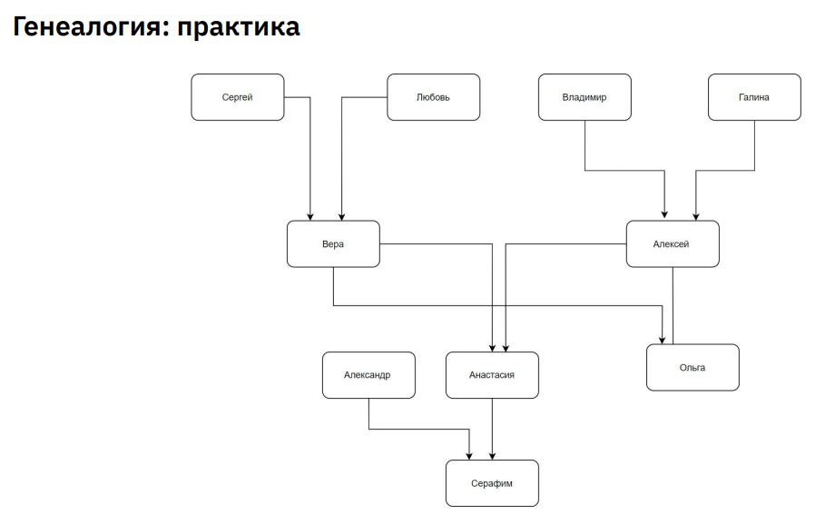

# Урок 5. Логическое программирование
## Classwork
### Шпаргалка
predicate_name(X) — предикат predicate_name истинен тогда, когда истинен X.
predicate_name(X, Y) — предикат predicate_name истинен тогда, когда истинны и X и Y одновременно.
С маленькой буквы пишутся значения (имена собственные).
С большой буквы пишутся переменные (объекты, принимающие несколько значений).
[X|H] — вертикальная черта означает разделение на “первую переменную X” и “H – всего что после X”.
[_|H] — нижнее подчеркивание означает “любая переменная”, без имени.
reverse(List1, List2) - встроенный метод, возвращающий true, когда список “развернутых” значений List2
полностью совпадает с List1.
В конце высказывания ставится точка. В начале запроса пишется знак вопроса и минус “?-”.
Больше информации по синтаксису языка Prolog - https://www.swi-prolog.org

### task001:
Генеалогия
● Контекст
Продолжаем исследовать генеалогию с помощью
логического программирования. Подобный пример мы уже
разбирали на лекции. На этот раз ваша задача реализовать
генеалогическое древо на языке Prolog самостоятельно.

● Ваша задача
Реализовать изображённое генеалогическое древо на языке
Prolog таким образом, чтобы про Алексея и Анастасию можно
было узнать кто их: мать, отец, дедушки, бабушки, дети.

### task002:
Максимальный элемент: логический
● Контекст:
Данную задачу мы уже видели и решали с помощью императивной и декларативной парадигмы. Теперь
давайте напишем её в логическом стиле.
● Ваша задача:
Написать предикат на языке Prolog, который для входного списка возвращает максимальный элемент в
этом списке.
### task003:
● Контекст
В предыдущем семинаре мы уже обсуждали важность выявления и удаления дубликатов в данных. В
этот раз ваша задача реализовать именно удаление из списка с помощью логического
программирования.
● Ваша задача
Реализовать логическую программу (предикат), которая принимает на вход массив и возвращает его
версию без дубликатов.

## Homework:
### task001:
Сумма элементов списка
● Контекст:
Мы уже видели множество решений этой задачи в различных
стилях. Пришло время решить её с помощью логической
парадигмы.
● Ваша задача:
Написать программу на языке Prolog для вычисления суммы
элементов списка. На вход подаётся целочисленный массив.
На выходе - сумма элементов массива.
